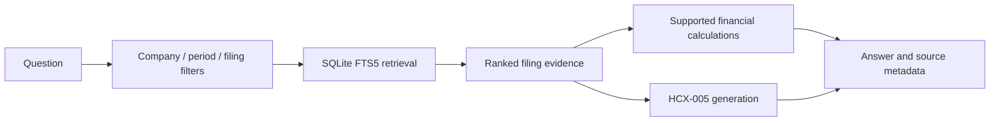

# DART Disclosure Research Agent

An AI-assisted financial disclosure research prototype developed for the 2026 Mirae Asset Securities AI Festival. The original application indexed **4,204 filings from 70 listed companies** and served a source-linked question-answering API on NAVER Cloud using **HyperCLOVA X HCX-005**.

This is a separate public portfolio edition. It contains application code, development tests, a synthetic local demo, and a summary of a 30-response quality review. It does not contain the organizer-provided corpus, private evaluation questions or responses, credentials, or the former server address. A live hosted demo is not provided.

## My role and development method

I undertook the project as a solo participant, using OpenAI Codex for AI-assisted implementation, debugging, and technical documentation. I worked through the corpus setup, API and cloud deployment, and financial disclosure checks with AI assistance. My disclosure research background informed the review of company attribution, reporting periods, financial metrics, units, and source support.

After submission, I used AI-assisted checks to review 30 agent responses against source filings and documented discrepancies, including growth-rate and margin calculations. The review identified material errors; it was not a claim that all 30 answers were correct. See [evaluation and lessons](docs/EVALUATION.md).

This repository demonstrates an implemented prototype and its limitations. It is not a claim of unaided software development or production-ready financial accuracy.

## What the application does

1. Reads filing metadata and XML/HTML text while retaining company IDs, reporting periods, receipt numbers, and correction status.
2. Preserves paragraph and table-row text in searchable chunks and builds a SQLite FTS5 index.
3. Applies rule-based company, period, and filing-type filters, then ranks lexical search results and selects evidence for each requested company.
4. Extracts selected revenue and operating-profit facts and uses decimal arithmetic for supported comparisons and margins.
5. Calls HCX-005 for other questions and appends filing metadata to the answer.

The system uses lexical retrieval with structured filters. It does not fine-tune a model or use vector embeddings. Its retrieval and generation workflow is fixed in application code.



## Run the synthetic demo

Python 3.12 is the original target environment. The demo uses two fictional companies and fabricated figures; none of its values are investment information.

```bash
python3 -m venv .venv
source .venv/bin/activate
pip install -r requirements.txt
python scripts/build_demo_index.py
python scripts/test_demo.py

SEARCH_DB="$PWD/data/index/demo.db" MIRAE_MOCK_LLM=1 \
  uvicorn app.main:app --host 127.0.0.1 --port 8000
```

In another terminal:

```bash
curl -G http://127.0.0.1:8000/answer \
  --data-urlencode 'question_id=demo-revenue' \
  --data-urlencode 'question=가상알파와 가상베타의 2025년 사업보고서 연결 매출액을 비교하고 차이를 계산해줘'
```

Expected financial facts: 가상알파 **1,000,000,000원**, 가상베타 **2,000,000,000원**, with 가상알파 smaller by **1,000,000,000원**. Supported financial questions use the actual retrieval and calculation code. In this demo mode, other questions receive a fixed mock LLM response. **No API key is needed, and no live model is called.**

To use HCX-005 with the synthetic index, copy `.env.example` to `.env`, supply your own `CLOVA_STUDIO_API_KEY`, and start the server without `MIRAE_MOCK_LLM=1`. Such requests use your model account. Do not commit `.env`.

## Original corpus workflow

The full corpus and index are not distributed here. The original index was locally verified to contain 70 companies, 4,204 documents, and 277,872 chunks. Rebuilding it requires authorized access to the original `manifest.jsonl`, `universe.csv`, and source documents:

```bash
python scripts/build_metadata_index.py \
  --corpus /path/to/authorized/corpus --output data/index/metadata.db
python scripts/build_content_index.py \
  --corpus /path/to/authorized/corpus \
  --metadata data/index/metadata.db --output data/index/search.db
```

The metadata builder intentionally checks the original corpus counts; it is not a generic importer for arbitrary datasets. Docker and systemd files preserve the original deployment approach, but a deployment still requires an index, environment configuration, and appropriate access controls. [API details](docs/API_SPEC.md)

## Evaluation and limitations

The original development checks were rerun locally on 2026-10-08: **122/122 retrieval checks** and **8/8 answer-logic checks** passed. These checks cover selected receipts, search scope, response components, and supported calculations. They are **not an overall answer-accuracy score**, and live HCX evaluations were not rerun for this public edition.

Known limitations in the retained application code include:

- Substring matching can resolve an unsupported company name to a different company, such as 카카오뱅크 to 카카오.
- The consolidated summary-table extraction path can accept a question requesting separate financial statements.
- A fourth-quarter question can select annual facts without deriving the quarter from annual and nine-month figures.
- Adding a citation footer does not establish that every claim is supported by the cited evidence.
- Financial extraction is limited to selected table formats and metrics. Table alignment, period selection, correction-chain matching, and multi-document reasoning remain imperfect.
- Prompt instructions and one repair attempt are not a comprehensive hallucination or prompt-injection defense.
- The API has no application authentication or rate limiting. Keep the demo on localhost; do not expose it as a production service.

The 30-response review found company, period, metric, arithmetic, and citation errors beyond the development checks. These findings have not all been fixed. See [evaluation and lessons](docs/EVALUATION.md).

## Repository guide

| Path | Purpose |
|---|---|
| `app/main.py` | FastAPI schema, orchestration, caching, source footer |
| `app/retriever.py` | Rule-based query routing, metadata filters, FTS5 search |
| `app/evidence.py` | Selected financial fact extraction and decimal calculations |
| `app/llm.py` | HCX-005 prompt, API call, and retries |
| `scripts/build_*_index.py` | Original corpus indexing and synthetic demo indexing |
| `scripts/evaluate*.py`, `eval/` | Original development checks; require the original index |
| `scripts/test_demo.py`, `examples/demo/` | Public synthetic smoke checks and fictional source files |
| `docs/EVALUATION.md` | Review method, observed failures, and improvement priorities |
| `docs/PROVENANCE.md` | Relationship to the submission source and this edition |

Author: Seokjin Oh. The original submission remains in the organizer-managed private repository. This public edition is maintained separately.
